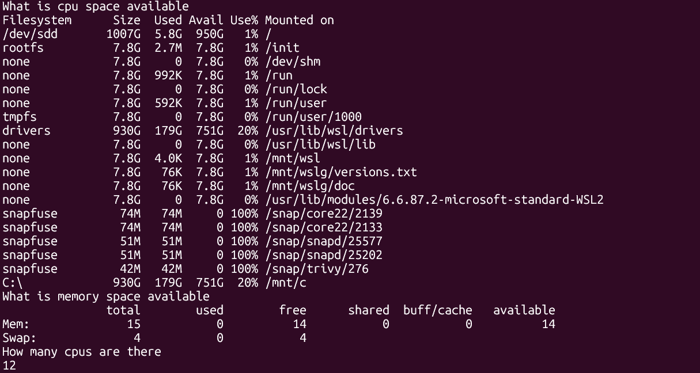

bash, ksh, sh, dash

#!/bin/bash - always use

How to execute a file
./ funmi.sh
sh funmi.sh

sext -x # debug mode
set -e # exit when there is an error. nb-it doesnt fail when there is error in pipe
set -o pipefail # exit the script when there is an error in pipe

df -h disk
free -g memory
nproc cpu

echo "What is cpu space available"
df -h 

echo "What is memory space available"
free -g

echo "How many cpus are there"
nproc 

set -x # debug mode
df -h 
free -g
nproc 
htop
ps -ef
ps -ef | grep amazon | awk -F " " '{print $2}'

stdin stdout stdder

what will be the output of date | echo "this"
response will be "this"

because date is only a system resource command

what will be the output of ps -ef | echo "this"
response will be the result of the first output will be the answer to the second

ps

wget to download

curl

sudo su -

find /

a=9
b=5

if $a>$b
then
echo "a is greater than b"
else
echo "b is greater than a"

for 

trap - what is trap command

Interview Questions
1. what is the most common commands you use on a daily basis
mkdir, ls, grep, |, touch, top, df -h, nproc, 

2. write a simple shell script to list all the processes
ps aux, ps -ef, htop

3. write a script to print only errors from a remote log
curl google.com | grep error

4. Write a shell script to print numbers divided by 3, 5 and not 15 fornumbers btw 1...100
#!/bin/bash

for num in {1..100}
do
    if (( num % 3 == 0 )); then
        echo "$num is divisible by 3"
    fi

    if (( num % 5 == 0 )); then
        echo "$num is divisible by 5"
    fi

    if (( num % 15 != 0 )); then
        echo "$num is NOT divisible by 15"
    fi
done

num % 3 == 0 
IF X divided by 3 equals 0

5. write a script to print the number of s in missisippi
!#/bin/bash

x=mississipi
grep -o "s" <<<"$x" | wc -l

6. how will you debug a shell script
set -x

7. what is crontab?
Crontab is a Linux tool used to schedule automated tasks (called cron jobs) that run at specific times or intervals — without you touching anything.
Crontab = the file where schedules are stored, Cron job = the task. Crontab = where the tasks are written

8. how do u open read only file
vim -r fun.sh

9. diff btw soft and hard link

10. what is the difference between break and continue

11. what are the disadvantages of shell scripting

12. is bash dynamically typed and why?

13. explain networking troubleshooting utilities?
traceroute google.com

14. different types of loops and usecase

15, how will you sort list of names in a file?
sort

16. how will you manage logs of a system that generate huge log files evertday>
app;ocations - logs (realtime) 10000000 logs

logrotate (gzip , zip)

