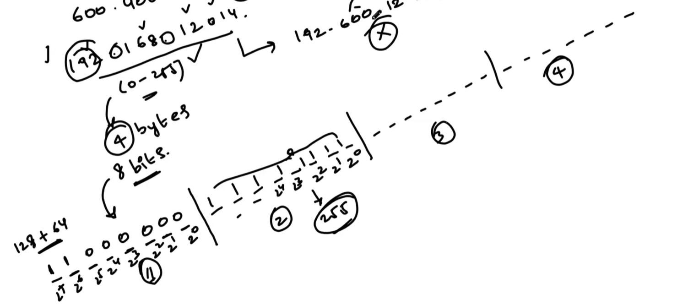

# AWS Networking & VPC Concepts – DevOps Notes

## 🌐 IP Addresses

IP addresses look like:  

172.99.2.4
192.168.1.10
10.0.0.5

- Each part (called an **octet**) ranges from **0 to 255**.  
- **No negative numbers** are allowed.  
- **1 bit** = can only be 0 or 1.  
- **1 byte** = 8 bits.  

---

## 🖧 Subnetting / Subnetworks

**Subnetting** is dividing a bigger network into smaller sub-networks for:

- Security  
- Privacy  
- Isolation  

**Types of subnets:**

| Type    | Description                          |
|---------|--------------------------------------|
| Public  | Can access the Internet (via IGW)   |
| Private | Cannot access the Internet directly |

---

## 📘 CIDR – Classless Inter-Domain Routing

CIDR defines **how many IP addresses** a subnet contains.  

**Formula:**

Total IPs = 2^(32 − prefix)
Usable Hosts = Total IPs − 2 # Network + Broadcast

**Examples:**

| CIDR           | IPs        | Usable Hosts |
|----------------|------------|--------------|
| 172.16.3.0/24  | 256        | 254          |
| 172.18.8.0/31  | 2          | 2            |
| 172.9.0.0/16   | 65,536     | 65,534       |
| 172.168.3.0/30 | 4          | 2            |
| 10.0.0.0/8     | 16,777,216 | 16,777,214   |

> **Private IP ranges (RFC1918):**
> - 10.0.0.0/8  
> - 172.16.0.0/12  
> - 192.168.0.0/16  

---

### 🔹 Which Octet Changes? (CIDR Logic)

An IP address has **4 octets**, each = 8 bits: `A.B.C.D`  

CIDR `/n` tells how many bits are part of the **network**.  

- **/8 → first octet fixed** → last 3 octets host  
- **/16 → first 2 octets fixed** → last 2 octets host  
- **/24 → first 3 octets fixed** → last octet host  
- **/32 → single IP**  

**Example:**  

10.9.1.0/24

Octet 1 → 8 bits

Octet 2 → 8 bits

Octet 3 → 8 bits

Octet 4 → host → 0-255

---

## 🏗 AWS Networking Basics

### VPC

- Defines your network’s **IP address range** (CIDR).  
- Example: `10.0.0.0/16`  

### Subnets

- Defined set of IP ranges inside the VPC.  
- Types: **Public** (internet access) & **Private** (no internet).  
- Common setup for high availability:

| Subnet Type | Number | Availability Zones |
|-------------|--------|------------------|
| Public      | 2      | One in each AZ   |
| Private     | 2      | One in each AZ   |

---

### Gateways

| Type              | Purpose                                               |
|------------------|-------------------------------------------------------|
| Internet Gateway (IGW) | Connects public subnets to the Internet          |
| NAT Gateway           | Allows private subnets to access the Internet without being directly reachable |
| Transit Gateway       | Connects multiple VPCs                               |

---

### Route Tables

- Each subnet is associated with a **route table**.  
- **Public subnet:** Route `0.0.0.0/0` → **Internet Gateway**  
- **Private subnet:** Route `0.0.0.0/0` → **NAT Gateway**  

---

### Load Balancers

- Placed in **public subnets**  
- Distributes traffic to instances in private subnets  
- Works with **Target Groups**  

---

### Security Groups (SG)

> “SGs are virtual firewalls that control traffic at the instance level. They are stateful — if inbound traffic is allowed, the response is automatically allowed back out.”

**SG Rule Components**

| Field           | Meaning                                         | Example |
|-----------------|------------------------------------------------|---------|
| Protocol        | Network protocol                               | TCP, UDP, ICMP |
| Port            | Port or range allowed                           | 22 (SSH), 80 (HTTP), 443 (HTTPS) |
| Source/Dest     | IP or SG allowed                                | 0.0.0.0/0, 203.0.113.5, another SG |
| Purpose/Desc    | Why traffic is allowed                          | SSH from my IP, Web traffic from Internet |

**Common Protocols**

| Protocol | Use Case |
|----------|----------|
| TCP      | SSH (22), HTTP (80), HTTPS (443), MySQL (3306) |
| UDP      | DNS (53), NTP (123), streaming |
| ICMP     | Ping / diagnostics |
| All      | Usually for outbound allow-all |

---

### Example: Security Groups for Web App Architecture

| SG       | Inbound Rules                         |
|----------|--------------------------------------|
| Web SG   | 80 / 443 → Public Internet            |
| App SG   | 8080 → Only from Web SG               |
| DB SG    | 3306 → Only from App SG               |

> Skills gained: layered network protection, secure multi-tier architecture.

---

### OSI Model (Networking Overview)

7 Layers (Top → Bottom):

1. **Application** – Apps communicate (e.g., browser, email)  
2. **Presentation** – Data formatting, encryption, compression  
3. **Session** – Manages communication sessions  
4. **Transport** – Reliable delivery (TCP/UDP)  
5. **Network** – Routing across networks (IP addresses, routers)  
6. **Data Link** – MAC addresses, switching, frames  
7. **Physical** – Cables, Wi-Fi, electrical signals  

---

### Ports

- Each application uses a **unique port number** to communicate.  
- Examples: 22 → SSH, 80 → HTTP, 443 → HTTPS  

---

## 💡 Quick Cheat Codes: CIDR & Subnets

| CIDR | Network Octets | Host Octets | Example |
|------|----------------|------------|---------|
| /8   | A . 0 . 0 . 0  | 3          | 10.0.0.0 |
| /16  | A . B . 0 . 0  | 2          | 10.9.0.0 |
| /24  | A . B . C . 0  | 1          | 10.9.1.0 |
| /32  | A . B . C . D  | 0          | Single IP |

---

### ✅ Summary

- **VPC** → network boundary & CIDR range  
- **Subnets** → split VPC into public/private zones  
- **Gateways** → IGW for internet, NAT for private subnet internet access  
- **Route Tables** → define paths for traffic  
- **Load Balancer** → public entry for apps  
- **Security Groups** → instance-level firewall  
- **NACLs** → subnet-level firewall (stateless)  
- **CIDR/Subnetting** → determines number of IPs and which octets change  

---

> “Understanding IP addressing, subnets, CIDR, and AWS networking is the foundation for building secure, scalable, and production-ready cloud architectures.”

888888888888888888888888888888888888
# IP Address
1. IP addresses look like:

172.99.2.4
192.168.1.10
10.0.0.5

Each part (called an octet) ranges from:

0 to 255

There are no negative numbers in IP addresses.

1 bit: can only be 0 or 1

1 byte = 8 bits

subnet
subnetworking

subneting part of a bigger network, security, privacy, isolation

types: private-no access to internet & public=access to internet(internet gateway)

CIDR - How many ip address can be in each subnet

172.16.3.0/24
32bits-24bits=8
2 raise to power 8 = 256

172.18.8.0/31
32-31=1
2 raise to power one =2

172.9.0.0/16
32-16=16
2 raise to power 16 = 65,536

If the number is 256 or less, the last octet will be zero.
if the number is more than 256, the last two octet will be zero

Also, 
another way to know which octet will change or which octect will be zero
10.9.1.0/24 
each octet is 8bits, so 8+8+8 (10.9.1) = 24, since we have 24, the last digit can be zero

10.9.0.0/16
8+8 = 16 (10.9) 

10.0.0.0/8
10 represents 8bits

📘 How to Know Which Octet Changes in an IP Address (CIDR Logic)

An IP address has 4 octets, and each octet = 8 bits:

A.B.C.D
8  8  8  8 bits

CIDR (/n) tells you how many bits belong to the network.

To know which octet can change (host part):

1️⃣ Add bits per octet to match the CIDR
Example: 10.9.1.0/24

Octet 1 → 8 bits

Octet 2 → 8 bits

Octet 3 → 8 bits
8 + 8 + 8 = 24 bits

Since /24 ends at the 3rd octet,
➡️ The 4th octet is the host
➡️ It can be 0–255

So:
✔ 10.9.1.0 is a valid network address for /24
✔ Last octet becomes zero by default

2️⃣ Example: 10.9.0.0/16

Octet 1 → 8 bits

Octet 2 → 8 bits
8 + 8 = 16 bits

Since /16 ends at the 2nd octet,
➡️ The 3rd and 4th octets are host parts
➡️ They become 0.0

So 10.9.0.0 is correct for /16.

3️⃣ Example: 10.0.0.0/8

Octet 1 → 8 bits
CIDR stops at the first octet

So:
➡️ Octets 2, 3, 4 = host part
➡️ They become 0.0.0

📌 Simple Rule (easy memory)

Just divide the CIDR by 8:

CIDR	Network octets	Host octets	Example
/8	A . 0 . 0 . 0	3 octets	10.0.0.0
/16	A . B . 0 . 0	2 octets	10.9.0.0
/24	A . B . C . 0	1 octet	10.9.1.0
🎯 Ultra-simple cheat code

/8 → first octet fixed

/16 → first 2 fixed

/24 → first 3 fixed

/32 → all fixed (single IP)

what will be the number of cidr?
what will be the number of ipaddresses

/8 = A = 256*256*256
/16 = B = 256*256
/24 = C = 256

what will be the number of cidr of the ipaddress

172.168.3.0/30
32-30=2
2 raise to power 2 = 4

10.0.0.0/8
32-8=24
2 raise to power 24 = 16,777,216

private subnets are usually 192 172 10 as the first octet

Subnetting / CIDR quick rules & your examples
Basic formula

Total IPs in a network = 2^(32 − prefix)

Example: /24 → 2^(32−24)=2^8 = 256 addresses

Usable hosts (traditional) = 2^(32 − prefix) − 2

(Subtract 2 for network & broadcast addresses)

Exceptions: /31 (2 addresses used for point-to-point per RFC3021) and /32 (single host).

Common shortcuts

/8 → 2^(24) = 16,777,216 IPs

/16 → 2^(16) = 65,536 IPs

/24 → 2^(8) = 256 IPs

Your examples (verified)

172.16.3.0/24

32−24=8 → 2^8 = 256 addresses (254 usable normally)

172.18.8.0/31

32−31=1 → 2^1 = 2 addresses (used for point-to-point links; both usable in /31)

172.9.0.0/16

32−16=16 → 2^16 = 65,536 addresses (65,534 usable normally)

172.168.3.0/30

32−30=2 → 2^2 = 4 addresses (2 usable hosts + network + broadcast)

10.0.0.0/8

32−8=24 → 2^24 = 16,777,216 addresses

Private address ranges (RFC1918)

10.0.0.0/8 (10...*)

172.16.0.0/12 (172.16.0.0 — 172.31.255.255) — note: this is /12, not entire 172.*

192.168.0.0/16 (192.168..)

# Ports
it  is a unique number for your application

# OSI Model
The OSI Model explains how data moves across a network—from one device to another—by breaking the process into 7 layers. Each layer has a specific job in preparing, sending, routing, and delivering data.

7 Layers (Top → Bottom):

Application – Where apps communicate over the network (e.g., web browsers, email).

Presentation – Formats data (encryption, compression, encoding).

Session – Manages communication sessions between devices.

Transport – Reliable delivery (TCP/UDP), error checking, segmentation.

Network – Routing data across networks (IP addresses, routers).

Data Link – MAC addresses, switching, frames, error detection.

Physical – Cables, Wi-Fi signals, electrical bits.

## AWS NETWORKING
VPC 

CIDR
📘 How to Know Which Octet Changes in an IP Address (CIDR Logic)

An IP address has 4 octets, and each octet = 8 bits:

A.B.C.D
8  8  8  8 bits

CIDR (/n) tells you how many bits belong to the network.

To know which octet can change (host part):

1️⃣ Add bits per octet to match the CIDR
Example: 10.9.1.0/24

Octet 1 → 8 bits

Octet 2 → 8 bits

Octet 3 → 8 bits
8 + 8 + 8 = 24 bits

Since /24 ends at the 3rd octet,
➡️ The 4th octet is the host
➡️ It can be 0–255

So:
✔ 10.9.1.0 is a valid network address for /24
✔ Last octet becomes zero by default

2️⃣ Example: 10.9.0.0/16

Octet 1 → 8 bits

Octet 2 → 8 bits
8 + 8 = 16 bits

Since /16 ends at the 2nd octet,
➡️ The 3rd and 4th octets are host parts
➡️ They become 0.0

So 10.9.0.0 is correct for /16.

3️⃣ Example: 10.0.0.0/8

Octet 1 → 8 bits
CIDR stops at the first octet

So:
➡️ Octets 2, 3, 4 = host part
➡️ They become 0.0.0

📌 Simple Rule (easy memory)

Just divide the CIDR by 8:

CIDR	Network octets	Host octets	Example
/8	A . 0 . 0 . 0	3 octets	10.0.0.0
/16	A . B . 0 . 0	2 octets	10.9.0.0
/24	A . B . C . 0	1 octet	10.9.1.0
🎯 Ultra-simple cheat code

/8 → first octet fixed

/16 → first 2 fixed

/24 → first 3 fixed

/32 → all fixed (single IP)

VPC
what determines the size of the vpc is the ipaddress range

SUBNET - defined set of ip ranges. the above ipaddresses will be split
public subnet 
private subnet

2 public subnets 0 one in each availability zone
2private subnets- one in each availability zone

Gateway - connects your vpc to a network. types: transit, NAT, Inetent

Internet Gateway - allows your vpc to connect to the internet. You create it, then attach it to the public subnet.
Route Table - vpc has a default route table, only allows the public subnet to communicate with the private subnet. You need to create a route table for the public and private subnets respectively. After creation, you associate to each subnet. For public subnet allow 0.0.0.0/0 with target internet gateway. it defines the path
Loadbalancer - it is in the public subnet
Target group
Natgateway - you can access the internet frominside, but the internet cannot reach you.
security group - virtual firewall for your ec2
NACL - virtual firewalls that controls the subnet, like security groups for your subnets

From the internet, if you are trying to reach an application in the private subnet.
it reaches the igw, to the loadbalancer, the lb need a route table and target group, 

🔹 Security Group Rule Components

A Security Group (SG) rule has four main fields:

Field	What it means	Example
Protocol	The type of network protocol the rule applies to	TCP, UDP, ICMP
Port	The port or range of ports allowed for that protocol	22 (SSH), 80 (HTTP), 443 (HTTPS)
Source / Destination	Where traffic is coming from (inbound) or going to (outbound)	0.0.0.0/0, 203.0.113.5, another SG
Purpose / Description	Why you’re allowing this traffic	SSH access from my IP, Web traffic from Internet
🔹 1️⃣ Protocol

Protocol = the type of communication your traffic uses.

Common protocols:

Protocol	Description	Common Use
TCP	Transmission Control Protocol	SSH (22), HTTP (80), HTTPS (443), MySQL (3306)
UDP	User Datagram Protocol	DNS (53), NTP (123), streaming
ICMP	Internet Control Message Protocol	Ping / diagnostics (echo request/reply)
All	Any protocol	Usually for outbound “allow all”

You can also specify the protocol by number, but TCP/UDP/ICMP names are easier.

🔹 2️⃣ Port

Port = the logical “door” your traffic goes through.

Single port: e.g., 22 → SSH

Range of ports: e.g., 8000–8080 → web apps or custom apps

All ports: 0–65535 → rarely used for inbound (usually okay for outbound)

🔹 3️⃣ Source (Inbound) / Destination (Outbound)

Source / Destination = who can send or receive traffic.

Inbound rules (incoming traffic)

Source = IP or SG allowed to connect

Examples:

203.0.113.5/32 → your home IP only

0.0.0.0/0 → anyone on the Internet

Another SG → traffic allowed from instances using that SG

Outbound rules (outgoing traffic)

Destination = IP or SG allowed to receive traffic from the instance

Example:

0.0.0.0/0 → instance can reach the Internet

10.0.0.0/16 → instance can reach all internal VPC IPs

🔹 4️⃣ Purpose / Description

Optional text describing why this rule exists

Makes it easier to manage SGs later.

Example:

SSH from my home IP

HTTP for public web access

MySQL for database replication

Task
Security Groups for Web App Architecture

Create:

Web SG → inbound 80/443

App SG → inbound 8080 only from Web SG

DB SG → inbound 3306 only from App SG

📌 Skills: layered network protection

000000000000000000000000000000000000000000
