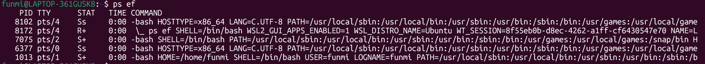

A process is a running instance on any program
e.g shell script is a process

Linux administrators task
view/check
killm stop, resume
prioritise, deprioritise

how to check the running processes
1. ps - shows processes in my current session
2. ps aux - shows processes in all sessions
3. ps aux | nl - shows the processes and the linenumber
ps aux | wc -l - shows word count

to main ways to check
ps aux shows the cpu and memory utilisation
ps ef shows the time, 
both shows the process id number

Kill Process
kill a process that is hanging etc

steps 

check the processes to identify whic
ps aux | grep java

kill pid
kill 3434

when you have a process not getting removed with just kill, you need to forcefully delete the process

kill-9 3434

KILL -3 3434
DOESNT KILL but guves thread drumb of java programs for debuggin

KILL -STOP 3434 - stop

KILL -CONT 3434 - continue

prioritise a task
renice -n 10 -p 343
renice -n -5 -p 343
sometimes the docktor thinks someone in the icu is more urgent but not always so. the cpu uses its internal algorithm to prororitise . a linux system adminiatratr can use the above renise command to reprortise. -8 has more priority than 1
Always check top or htop to see CPU usage before changing priorities.

services
runs in background. starts in theboot of the server
A service is a program that runs in the background.
If it starts at boot, it automatically runs when the server powers on. Examples: sshd, cron, nginx.
how to list services

systemctl list-units --type=services

Difference between service and process
systemctl start cronjob
services are special kinds of process thar start at the time of booting your server, process doesnt start at boot time.
